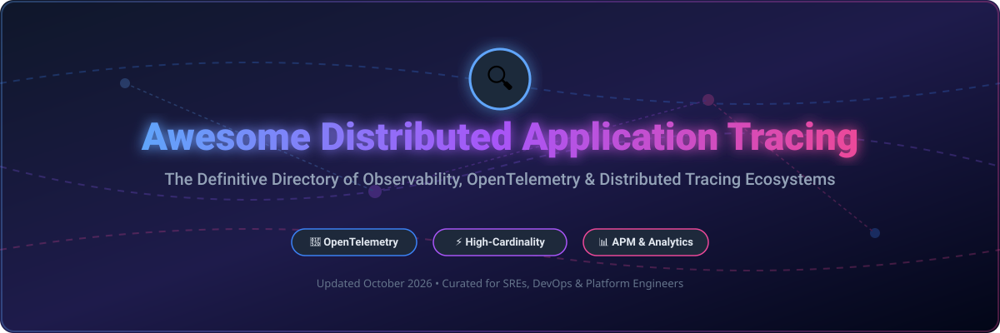

# Awesome Distributed Application Tracing 🔍 📊 ⚡

  

  
  
  
  
  
  

---

## 🌟 Top Distributed Application Tracing & Observability Ecosystem 🌐

**Curated List of Commercial Tracing SaaS Platforms & Open-Source Distributed Tracing Tools**  
*Focused on OpenTelemetry Instrumentation, Span Collection, Trace Storage, Service Graph Analysis, Root Cause Analysis & Self-Hosted Tracing Backends* 🚀

**Last updated: October 2026** 📅

---

### 📌 Overview & SEO Summary 🔍

Welcome to the definitive, SEO-optimized curated directory of **distributed application tracing platforms**, **open-source tracing backends**, and **cloud-native observability frameworks**. As microservices architectures, serverless functions, and distributed cloud deployments expand, end-to-end trace collection and high-cardinality span querying have become essential for Site Reliability Engineers (SREs), DevOps leaders, and platform engineers.

Whether you require enterprise-grade commercial SaaS observability platforms (such as *AWS X-Ray*, *Datadog APM*, *Dynatrace*, or *Honeycomb*) or self-hostable open-source alternatives (like *SigNoz*, *Apache SkyWalking*, *Jaeger*, or *Grafana Tempo*), this comprehensive guide covers category leaders, OpenTelemetry (OTel) pipelines, and ClickHouse-backed storage solutions.

**Key Distributed Tracing & Observability Market Insights:** 💡
- **SigNoz** is the **fastest-growing open-source Datadog alternative**, boasting **32,300+ GitHub_Stars**, ClickHouse-backed trace storage, and unified metrics, logs, and trace correlation. 📊
- **Apache SkyWalking** is a **graduated CNCF observability suite** with **24,900+ GitHub_Stars**, excelling at Java/eBPF microservices performance monitoring and mesh telemetry. 🌌
- **Jaeger** remains the **industry standard open-source tracing backend**, created by Uber, featuring **23,200+ GitHub_Stars** and native OpenTelemetry protocol (OTLP) ingestion. 🕵️
- **OpenObserve** offers a **Rust-powered cloud-native backend** with **22,200+ GitHub_Stars**, reducing trace and log storage costs by up to 140x compared to Elasticsearch. 🌊

---

## 📑 Table of Contents 📜

- [🏢 SaaS & Commercial Platforms](#-saas--commercial-platforms)
- [🔓 Open-Source GitHub Projects](#-open-source-github-projects)
- [🛠️ How to Contribute](#%EF%B8%8F-how-to-contribute)
- [📊 Star History](#-star-history)
- [🤝 Support & Sponsorship](#-support--sponsorship)
- [⚠️ Disclaimer](#%EF%B8%8F-disclaimer)

---

## 🏢 SaaS & Commercial Platforms 💼

> **Market Analysis & Dynamics:** The global Application Performance Monitoring (APM) and Distributed Tracing market is estimated at **$5.2 Billion in 2026** and is expected to reach **$9.8 Billion by 2030** (CAGR ~17.2%). The sector is **moderately fragmented**, led by large cloud infrastructure providers (AWS) and full-stack observability giants (Datadog, Dynatrace, ServiceNow/Lightstep, New Relic) alongside specialized high-cardinality observability pioneers (Honeycomb).

| SaaS / Commercial Platform | Company / Owner | Valuation / Revenue | Standard Edition Starting Price | Free Tier / Free Trial Limits | Description |
| :--- | :--- | :--- | :--- | :--- | :--- |
| **[AWS X-Ray](https://aws.amazon.com/xray/)** ☁️ | Amazon.com, Inc. | **~$2.0 Trillion Market Cap** | **$5.00 per 1M traces recorded** ($0.50 per 1M traces retrieved) | **100,000 traces recorded + 1M traces retrieved per month** (Permanent Free Tier) | **AWS-native distributed tracing** — Seamlessly trace requests across AWS Lambda, API Gateway, ECS, and EC2 with automatic service map generation. ⚡ |
| **[Lightstep (ServiceNow)](https://lightstep.com/)** 💡 | ServiceNow, Inc. | **~$150 Billion Market Cap** | **$100.00/month** Pro starting tier (Custom enterprise pricing available) | **100 Million spans per month** (Permanent Free Tier) | **Distributed tracing with change intelligence** — Built natively for OpenTelemetry with automated root cause analysis. 🧠 |
| **[Datadog APM](https://www.datadoghq.com/product/apm/)** 🐶 | Datadog, Inc. | **~$40 Billion Market Cap** | **$31.00 per host/month** ($1.70 per 1M indexed spans) | **14-day full feature free trial** (No permanent free tier) | **Industry-leading full-stack APM** — Continuous profiling, end-to-end distributed tracing, and live tail span search. 🐕 |
| **[Dynatrace](https://www.dynatrace.com/)** 🔮 | Dynatrace, Inc. | **~$15 Billion Market Cap** | **$0.04 per host/hour** ($0.01 per GiB-hour full-stack memory) | **15-day full feature free trial** (No permanent free tier) | **Causal AI-powered observability** — Davis AI engine automatically analyzes topology graphs and PurePath traces without manual sampling. 🤖 |
| **[New Relic Trace](https://newrelic.com/)** 🚀 | New Relic, Inc. | **~$5 Billion Valuation** (Acquired by Francisco Partners/TPG) | **$99.00 per core user/month** ($0.30 per GB ingestion above free limit) | **100 GB ingestion per month + 1 full platform user** (Permanent Free Tier) | **Consumption-based observability** — Infinite Tracing for tail-based sampling with 700+ turnkey integrations. 📉 |
| **[Grafana Cloud Traces](https://grafana.com/products/cloud/traces/)** 🟠 | Grafana Labs | **~$3 Billion Valuation** | **$29.00/month Pro tier** ($0.50 per GB trace ingestion over free limit) | **50 GB traces per month with 14-day retention** (Permanent Free Tier) | **Managed Grafana Tempo service** — Cost-effective object-storage tracing backend with TraceQL query language. 📈 |
| **[Honeycomb](https://www.honeycomb.io/)** 🍯 | Honeycomb.io | **~$500 Million Valuation** (Series C) | **$130.00/month Pro plan** (Includes 1.5 Billion event volume) | **20 Million events per month** (Permanent Free Tier) | **High-cardinality event tracing** — BubbleUp analysis for rapid anomaly detection in complex microservices. 🐝 |
| **[Coralogix](https://coralogix.com/)** 🔵 | Coralogix | **~$400 Million Valuation** (Series C) | **$0.20 per GB ingested** (Data streaming retention tier) | **1 GB per day ingestion** (Permanent Free Tier) | **In-stream observability platform** — Real-time telemetry analytics without costly index-everything storage burdens. 🌊 |
| **[Lumigo](https://lumigo.io/)** 🔬 | Lumigo | **~$100 Million Valuation** (Series A) | **$99.00/month** (Includes 100,000 trace spans) | **150,000 trace spans per month** (Permanent Free Tier) | **Serverless & container tracing** — One-click automated distributed tracing for AWS Lambda, Kubernetes, and microservices. ⚡ |

---

## 🔓 Open-Source GitHub Projects 🛠️

*Sorted by GitHub_Stars_Count (Descending)* 🌟

- **[SigNoz](https://github.com/SigNoz/signoz)**   
  **Open-source Datadog alternative with OpenTelemetry-native APM**, Apache-2.0 licensed. **32.3K+ GitHub_Stars** — **unified traces, metrics, and logs** in a single pane . **ClickHouse-powered high-cardinality storage** . Built-in dashboards, alerts, and exception tracking . **The fastest-growing open-source observability platform** . 📊

- **[Apache SkyWalking](https://github.com/apache/skywalking)**   
  **Observability platform for distributed systems**, Apache-2.0 licensed. **24.9K+ GitHub_Stars** — **APM, service mesh telemetry, eBPF profiling, and metrics aggregation** . Designed for cloud-native, microservices, and containerized architectures . **CNCF Graduated project** . 🌌

- **[Jaeger](https://github.com/jaegertracing/jaeger)**   
  **Distributed tracing platform by Uber**, Apache-2.0 licensed. **23.2K+ GitHub_Stars** — **the standard open-source tracing backend** . End-to-end distributed tracing, root cause analysis, and service dependency graphs . **CNCF Graduated project** . Battle-tested at Uber scale . 🕵️

- **[OpenObserve](https://github.com/openobserve/openobserve)**   
  **Cloud-native observability platform**, Apache-2.0 licensed. **22.2K+ GitHub_Stars** — **logs, metrics, traces, and RUM** in one unified binary . Rust-based architecture providing **140x lower storage costs than Elasticsearch** . 🌊

- **[Pinpoint](https://github.com/pinpoint-apm/pinpoint)**   
  **APM for large-scale distributed systems**, Apache-2.0 licensed. **13.8K+ GitHub_Stars** — Java/PHP/Python agent-based monitoring . Call stack visualization, server map topology, and real-time active thread monitoring . 📍

- **[Coroot](https://github.com/coroot/coroot)**   
  **Open-source observability with zero instrumentation**, Apache-2.0 licensed. **7.9K+ GitHub_Stars** — **eBPF-based metrics, logs, traces, and continuous profiling** . Automatically detects application performance anomalies and root causes . 🎯

- **[OpenTelemetry Collector](https://github.com/open-telemetry/opentelemetry-collector)**   
  **Vendor-neutral telemetry processing proxy**, Apache-2.0 licensed. **7.6K+ GitHub_Stars** — High-performance proxy for receiving, processing, filtering, and exporting telemetry data (OTLP) . 🔭

- **[OpenTelemetry Go SDK](https://github.com/open-telemetry/opentelemetry-go)**   
  **Official Go implementation of OpenTelemetry**, Apache-2.0 licensed. **6.5K+ GitHub_Stars** — Enterprise Go distributed tracing instrumentation libraries and API standard . 🐹

- **[Grafana Tempo](https://github.com/grafana/tempo)**   
  **High-scale distributed tracing backend**, AGPL-3.0 licensed. **5.5K+ GitHub_Stars** — **Object-storage only backend** requiring zero search indexes . **TraceQL query engine** integrated with Grafana, Loki, and Prometheus . 📈

- **[Uptrace](https://github.com/uptrace/uptrace)**   
  **Open-source APM powered by OpenTelemetry and ClickHouse**, BSD-2-Clause licensed. **4.2K+ GitHub_Stars** — Monolithic single-binary distributed tracing and metrics platform with pre-built Grafana dashboard compatibility . 📉

- **[OpenTelemetry JS SDK](https://github.com/open-telemetry/opentelemetry-js)**   
  **Official JavaScript / TypeScript OpenTelemetry SDK**, Apache-2.0 licensed. **3.4K+ GitHub_Stars** — Node.js and browser frontend distributed tracing instrumentation . 🟨

- **[OpenTelemetry Python SDK](https://github.com/open-telemetry/opentelemetry-python)**   
  **Official Python OpenTelemetry SDK**, Apache-2.0 licensed. **2.6K+ GitHub_Stars** — Tracing instrumentation for FastAPI, Django, Flask, and gRPC Python microservices . 🐍

- **[OpenTelemetry Java SDK](https://github.com/open-telemetry/opentelemetry-java)**   
  **Official Java OpenTelemetry SDK & Auto-Instrumentation**, Apache-2.0 licensed. **2.4K+ GitHub_Stars** — Bytecode manipulation and auto-instrumentation agent for Spring Boot and JVM frameworks . ☕

- **[Hypertrace](https://github.com/hypertrace/hypertrace)**   
  **Cloud-native distributed tracing platform**, Apache-2.0 licensed. **500+ GitHub_Stars** — Service graph generation and trace-to-log correlation built on OpenTelemetry and Jaeger . 🔗

---

## 🛠️ How to Contribute 🤝

Contributions are very welcome! Follow these simple steps to submit new SaaS tracing products or open-source distributed tracing tools: 💡

1. 🍴 **Fork** this repository.
2. 📝 **Add or edit** entries in `README.md` following the exact table/list format and styling rules.
3. 🔗 Include official website/GitHub links, exact stargazers badge, pricing/free tier details, and clear concise descriptions.
4. 🚀 Submit a **Pull Request** with a descriptive summary of your additions.

---

## 📊 Star History 📈

---

## 🤝 Support & Sponsorship 💖

If you find this curated distributed tracing list helpful, please consider supporting the project: 🌟

- ⭐ **Star** this repository on GitHub to boost its visibility!
- 🔀 **Fork** and share it with fellow SREs, platform engineers, and cloud architects.
- ☕ **Sponsor**: Support ongoing curation via the [GitHub Sponsor Dashboard](https://github.com/sponsors/ishandutta2007).

---

## ⚠️ Disclaimer ℹ️

- This is a **community-curated list** provided for informational and educational purposes. ℹ️
- **SaaS Pricing & Free Tier Limits** are based on publicly disclosed plans as of October 2026. Always confirm pricing tiers directly on provider websites before enterprise deployment. 💲
- **Open-source tracing tools** require infrastructure deployment, storage cluster tuning (ClickHouse, Elasticsearch, Object Storage), and ongoing maintenance. Conduct proof-of-concept benchmarks for your workload span volume before production adoption. 🔬

---

  <b>Made with ❤️ for SREs, DevOps Engineers, and Distributed Tracing Enthusiasts worldwide.</b>

